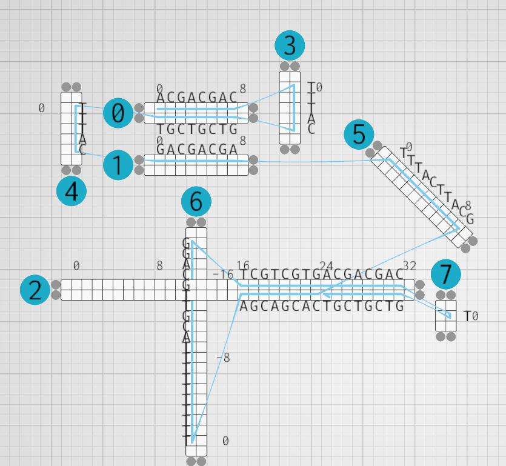

# Dependencies

## All platforms

You need to have the latest rust compiler installed see [this page](https://www.rust-lang.org/tools/install).

** If you already have `cargo` installed but face compilation issue, make sure that you have the lastest version by running `rustup update` **

## Linux
You need the GTK3 development packages, and a C++ compiler to build the dependency `rfd`.

* Debian/Ubuntu: `apt-get install build-essential libgtk-3-dev`
* Fedora: `dnf install gtk3-devel`
* Arch: `pacman -S gtk3`

You also need to have the **Vulkan** driver for your graphic card installed. The installation methods depends on your distribution and graphic card,
but there should be a tutorial on the internet for any combination of those.

# Importing Cadnano/Scadnano files

ENSnano does not currently handles deletions/loops/insertions in its designs. Here is how these features are handled
when importing a cadnano/scadnano file

* The nucleotides that are "deleted" are removed from the design
* Insertions are replaced by a single strand on an attributed helix

## Example

In this cadnano design, deleted nucleotides are removed and loops are replaced by single strands

 

In this scadnano design, insertions and loopouts are replaced by single strands

 

# Thirdparties

The licenses of the dependencies are listed in `thirdparties/license.html`

This software uses the following fonts which are distributed under the SIL OpenFont License
* [Inconsolata-Regular](https://fonts.google.com/specimen/Inconsolata)
* [Inter](https://fonts.google.com/specimen/Inter) (Glyphs from this font are used in the file `font/ensnano2.ttf`)

The font `font/DejaVuSansMono.ttf` is in public domain.
